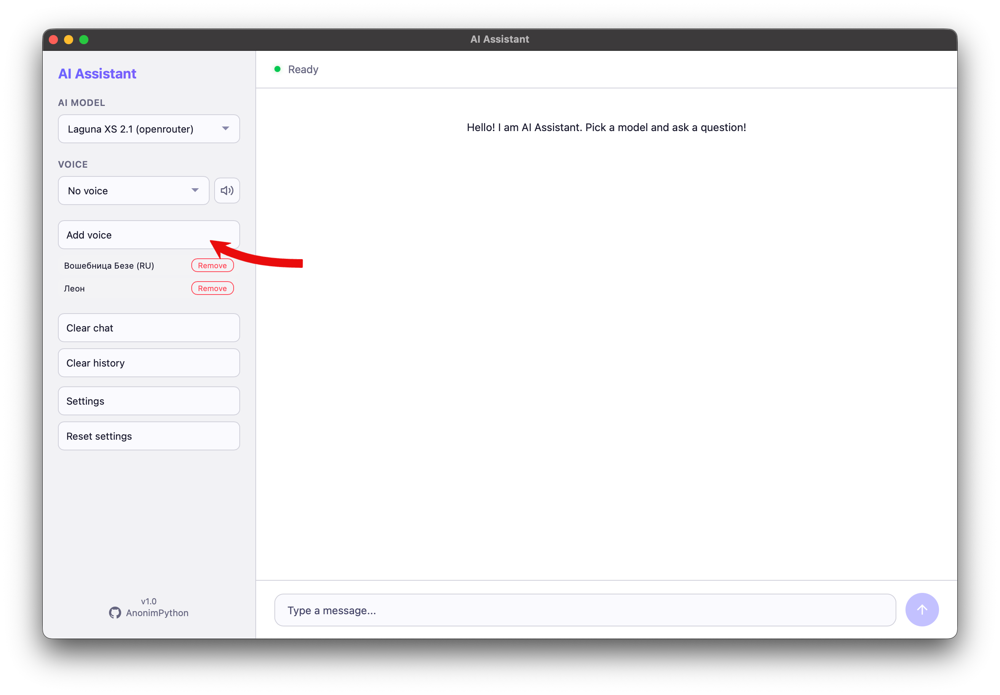
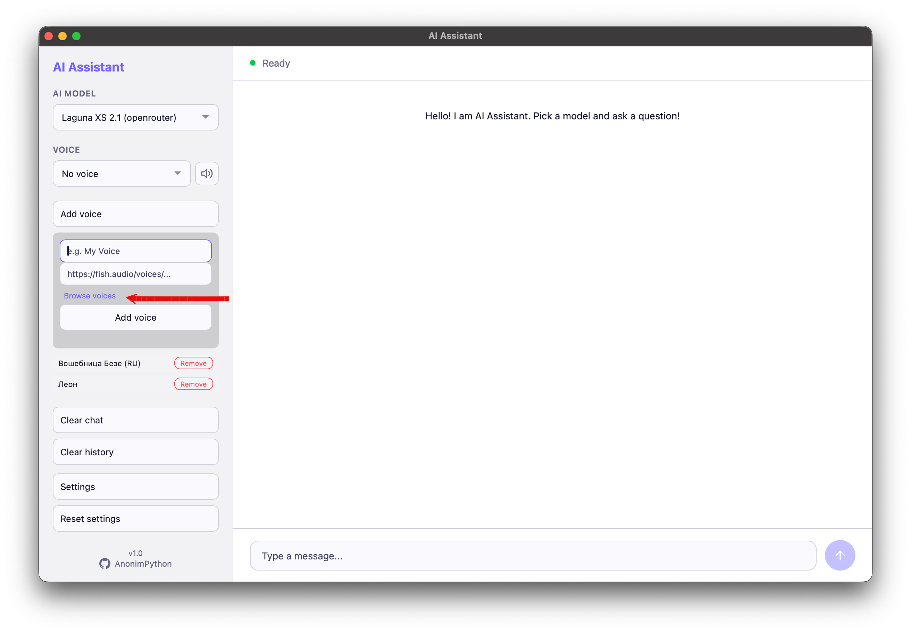
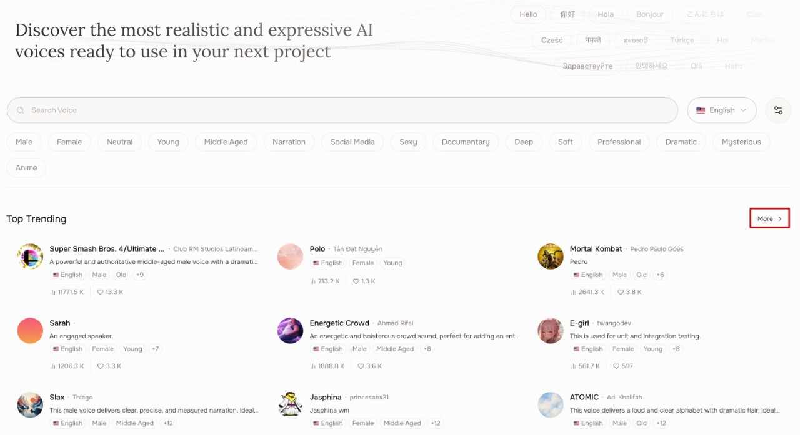
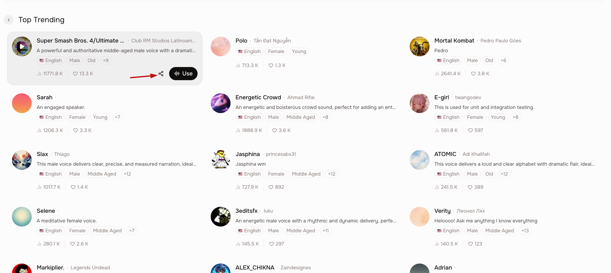
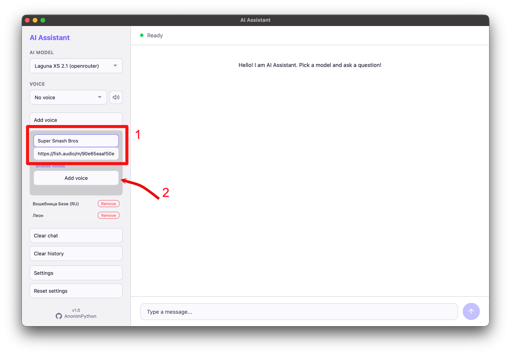

# AI Assistant

Мульти-модельный AI ассистент с голосовым выводом. Работает как **веб-приложение** и **десктоп-приложение**.

## Возможности

- **Множество AI моделей**: OpenRouter + HuggingFace (13+ моделей)
- **Голосовой вывод**: 17+ голосов через Fish Audio TTS
- **2 режима работы**:
  - Веб -- запусти и открой в браузере
  - Десктоп -- нативное окно (через pywebview)
- **Docker** -- готовый контейнер
- **Автоустановщик** -- при первом запуске попросит ввести API ключи
- **Поддержка Markdown** -- ответы ИИ отображаются с полным форматированием

## Скриншоты

| Темы | Настройки |
|------|-----------|
|  |  |
|  |  |
|  | |
|  | |

## Быстрый старт

### 1. Установка зависимостей

```bash
pip install -r requirements.txt
```

### 2. Запуск

**Веб-версия** (открой http://localhost:5066):

```bash
python app.py
```

**Десктоп-версия**:

```bash
python desktop.py
```

**Docker**:

```bash
docker build -t ai-assistant .
docker run -d -p 5066:5066 ai-assistant
```

### 3. Первый запуск

При первом запуске приложение запросит 3 API ключа:

| Сервис      | Где получить                           |
| ----------- | -------------------------------------- |
| OpenRouter  | https://openrouter.ai/keys             |
| Fish Audio  | https://fish.audio/                    |
| HuggingFace | https://huggingface.co/settings/tokens |

---

## Как добавить свой голос

Добавь любой голос из Fish Audio в своего ассистента. Скриншоты ниже показывают весь процесс.

| Шаг | Скриншот |
|-----|----------|
| 1 — Найди голос на fish.audio |  |
| 2 — Нажми на карточку голоса |  |
| 3 — Скопируй URL голоса |  |
| 4 — Открой Добавить голос в приложении |  |
| 5 — Вставь ссылку и сохрани |  |

**Альтернатива:** Открой приложение, перейди в Настройки -> Добавить голос и нажми «Как добавить голос» — там такая же инструкция со скриншотами.

---

## Сборка exe/dmg

### Windows

```cmd
pip install pyinstaller && pyinstaller --noconfirm --onedir --windowed --name "AI Assistant" --icon source/static/app_img/icon.ico --add-data "source/templates;templates" --add-data "source/static;static" --add-data "source/translations.py;." --add-data "source/config_manager.py;." --version-file version_info.txt main.py && xcopy /E /I "dist\AI Assistant" "%USERPROFILE%\Desktop\AI Assistant" && echo Done
```

### macOS

```bash
cd build
chmod +x build_macos.sh
./build_macos.sh
```

### Linux

```bash
make build-exe
```

---

## Docker

```bash
# Сборка
docker build -t ai-assistant .

# Запуск
docker run -d -p 5066:5066 --name ai-assistant ai-assistant

# Остановка
docker stop ai-assistant
```

---

## План развития

- **Браузер голосов** -- встроенный каталог голосов прямо в приложении (не нужно ходить на fish.audio), превью перед добавлением, добавление в один клик
- **Больше AI провайдеров** -- интеграция с дополнительными поставщиками моделей (Anthropic, Groq, Together AI и др.)
- **Голосовой ввод** -- распознавание речи с микрофона (в планах)
- **Встраивание на сайты** -- виджет для сторонних сайтов
- **Память диалогов** -- долгосрочный контекст на основе саммари
- **Мульти-сессии** -- несколько независимых чат-сессий
- **Система плагинов** -- пользовательские инструменты и интеграции
- **Нативное macOS приложение** -- standalone .app с нативным UI (за пределами pywebview)

---

## Структура проекта

```
ai_assistant/
├── app.py              # Flask веб-сервер
├── desktop.py          # Десктоп-обёртка (pywebview)
├── test_models.py      # Тестирование моделей
├── config_manager.py   # Управление API ключами
├── requirements.txt    # Зависимости
├── Dockerfile          # Docker контейнер
├── Makefile            # Команды сборки
├── README_EN.md        # Документация на английском
├── README_RU.md        # Документация на русском
├── templates/          # HTML шаблоны
│   ├── index.html      # Интерфейс чата
│   └── setup.html      # Страница настройки
├── static/             # Статические файлы
│   ├── css/style.css
│   ├── js/app.js
│   ├── how_to_add_voice/  # Скриншоты инструкции
│   └── repo images/       # Скриншоты для README
└── build/              # Скрипты сборки
    ├── build_windows.bat
    ├── build_macos.sh
    └── installer.iss
```

---

## Технологии

- **Бэкенд** -- Python Flask
- **Фронтенд** -- Vanilla JS, CSS custom properties
- **Markdown** -- marked.js (CDN)
- **TTS** -- Fish Audio API
- **Десктоп** -- pywebview
- **Docker** -- multi-stage build
